# Tidy Tails Grooming

**Tidy Tails Grooming** is a full-stack Django web application for a modern UK dog-grooming business.  
It allows users to browse services, make and manage bookings, send contact messages, and for admins to manage everything from a unified dashboard.  
View the live site [here](https://tidy-tails-grooming-9601f060a3eb.herokuapp.com/).

## Table of Contents

- [User Stories](#user-stories)
- [Design](#design)
  - [Colour Palette](#colour-palette)
  - [Typography](#typography)
  - [Database Schema](#database-schema)
- [Testing](#testing)
  - [Compatibility and Responsiveness](#compatibility-and-responsiveness)
  - [Functional Testing](#functional-testing)
  - [Validation](#validation)
  - [Lighthouse](#lighthouse)
  - [Bugs](#bugs)
  - [Unfixed Bugs](#unfixed-bugs)
- [Technologies](#technologies)
- [Deployment](#deployment)
  - [Version Control](#version-control)
  - [Deployment to Heroku](#deployment-to-heroku)
  - [Cloning Repository](#cloning-repository)
- [Potential Future Developments](#potential-future-developments)
- [Credits](#credits)
  - [Media](#media)

## User Stories

1. As a new visitor, I want to clearly see what the business offers, so that I understand available grooming services.

  - The services page shows all of the active services that the business offers.

    <details><summary>Services Page</summary>

    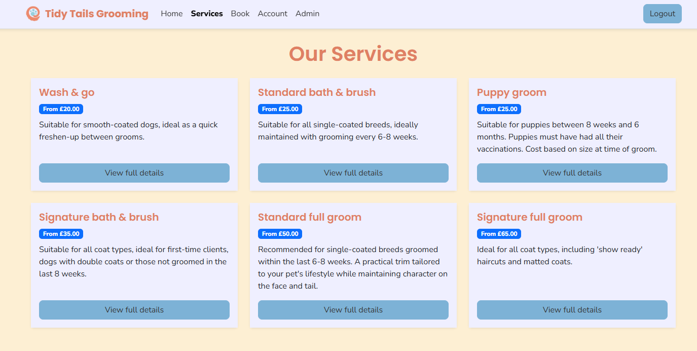

    </details>

2. As a user, I want to register and log in easily, so that I can manage my bookings.

  - The site includes registration and login functionality, both easy to navigate to, which allows users to create and manage bookings.

    <details><summary>Login</summary>

    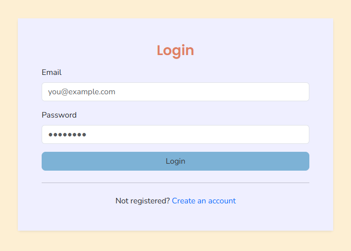

    </details>

    <details><summary>Registration</summary>

    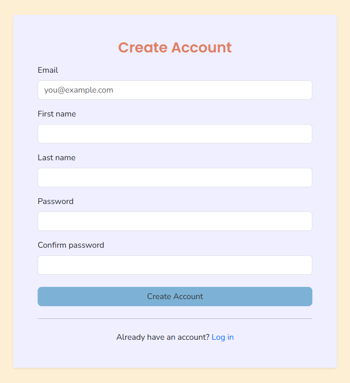

    </details>

3. As a returning customer, I want to view, edit, or cancel existing bookings.

  - Under the Account page is a section for My Bookings, where users can see a clear list of any upcoming bookings (in chronological order), as well as any cancelled or completed bookings. Users are able to edit applicable fields as well as cancel bookings completely, which includes logic to make that slot available for new bookings.

    <details><summary>Bookings</summary>

    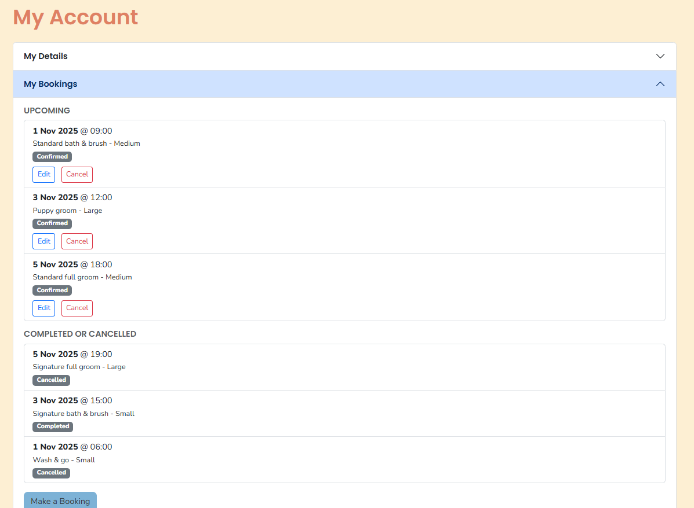

    </details>

4. As an admin, I want to manage services, bookings, and messages from a single dashboard.

  - The website includes an Admin Dashboard page that is only available to admins (superusers). From this dashboard, the admin has a variety of options to manage services, bookings, and messages:

    **Services:**
    - Create new services, which then dynamically populate the Services page.
    - View all services, both active and inactive.
    - Toggle a service’s active status; inactive services do not show up on the Services page and are not available for new bookings.
    - Edit the details for all services.
    - Delete a service if it is marked as inactive and there are no upcoming bookings.

    **Bookings:**
    - View all bookings made by users, both upcoming and completed/cancelled.
    - Mark bookings as complete.
    - Cancel bookings.

    **Messages:**
    - View all messages sent via the site’s Contact form.
    - Delete messages.

    <details><summary>Admin Dashboard</summary>

    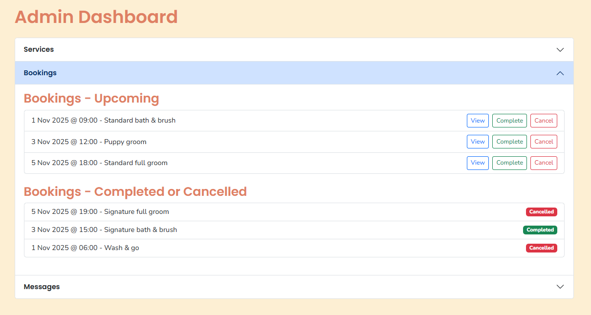

    </details>

5. As any visitor, I want the site to be simple, responsive, and accessible on any device.

  - The site was designed to be responsive on all devices, from widescreen monitors to mobile devices.

    <details><summary>Responsive - Tablet</summary>

    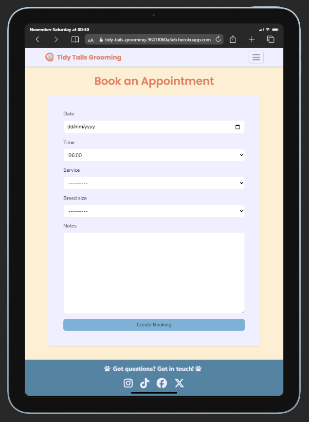

    </details>

    <details><summary>Responsive - Mobile</summary>

    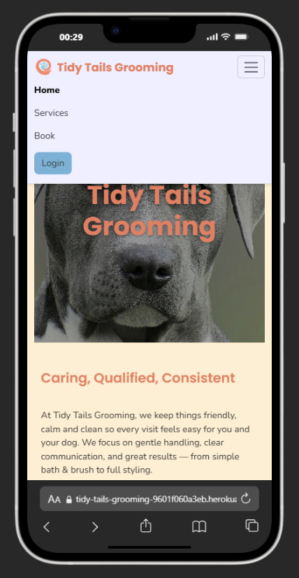

    </details>

6. As a customer, I want a clear confirmation that my booking or message was submitted successfully.

- A success alert pops up at the top of the page to confirm that the booking was made successfully. This alert clears automatically after a few seconds, or can be dismissed manually.

    <details><summary>Booking confirmation</summary>

    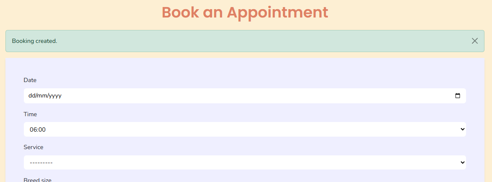

    </details>

7. As a logged-in user, I want the contact form to auto-fill my details to save time.

- When a logged-in user navigates to the contact page, the form is auto-filled with their email, first name, and last name upon loading the page.

    <details><summary>Contact Autofill</summary>

    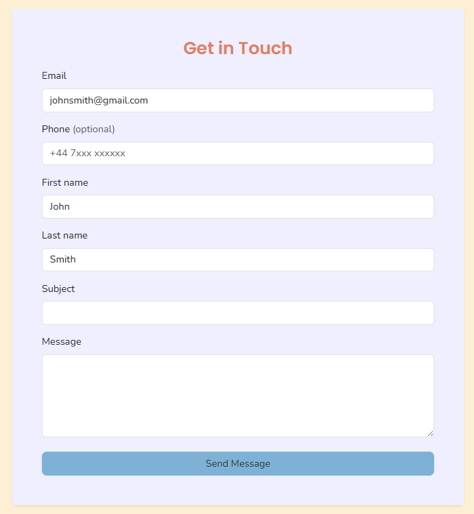

    </details>

8. As an admin, I want to toggle services as active/inactive without deleting existing data.

- As previously mentioned, backend logic ensures that when a service is marked as inactive, existing bookings with that service selected are unaffected. Users are even able to change their booking to another service (through the editing form) and still revert back to their original service if desired, regardless of whether it was marked as inactive at any point after the original booking was made. This is done by capturing a snapshot of the service as the original service, which can always be returned to.

    <details><summary>Service Inactive</summary>

    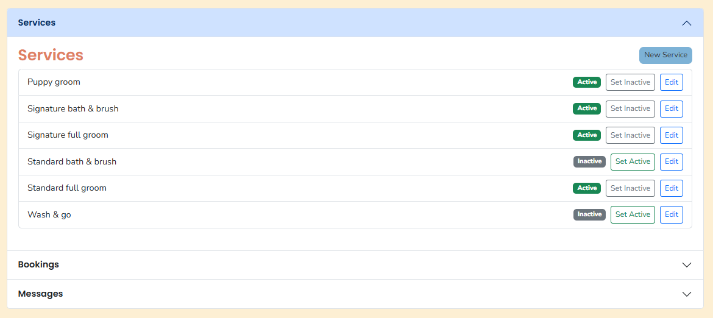

    </details>

    <details><summary>Bookings Unaffected</summary>

    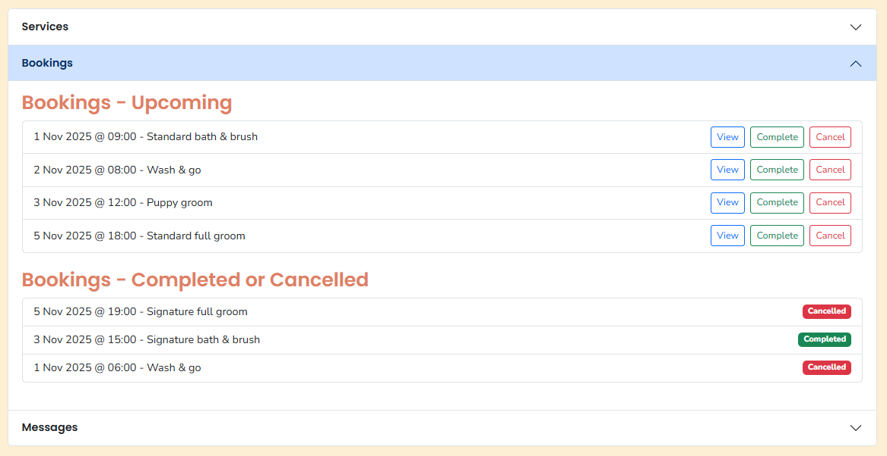

    </details>

9. As a potential customer, I want to browse service details and pricing without logging in.

- All site users, regardless of whether they are logged in or not, have access to the Services page. From here they can see a list of all available services with a brief description and the starting price; this allows users to get a basic understanding of what the service entails and its cost without needing to read through the full details. Should they want to see more about the service, clicking the ‘View full details’ button opens a modal that explains the service in full and a guide price for each breed size.

    <details><summary>Service Details</summary>

    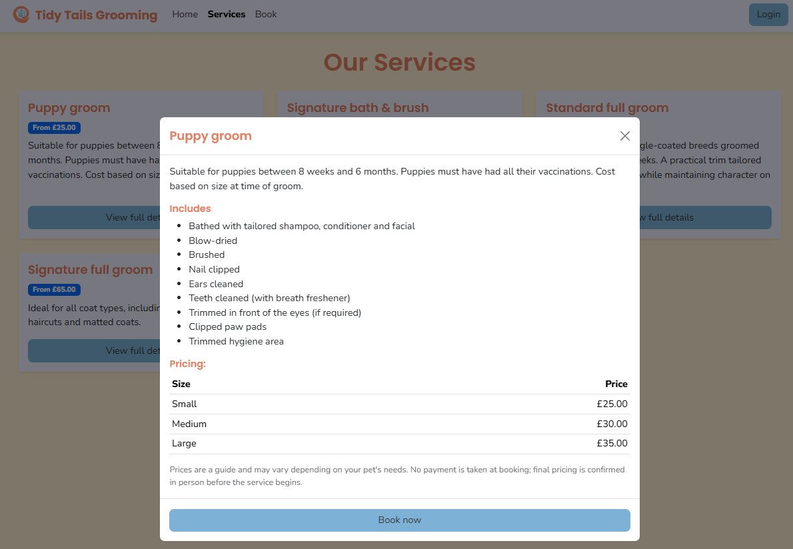

    </details>

10. As a user, I want to see visual feedback when I perform an action, such as alerts and modals.

- The site features multiple confirmation modals and success alerts to provide clear visual feedback and ensure the user is always aware of the actions they perform.

    <details><summary>Feedback - Modal</summary>

    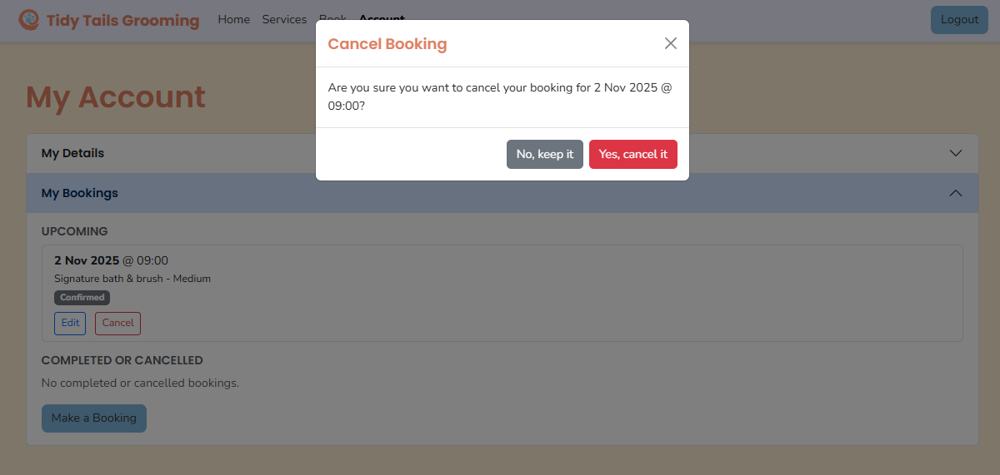

    </details>

    <details><summary>Feedback - Alert</summary>

    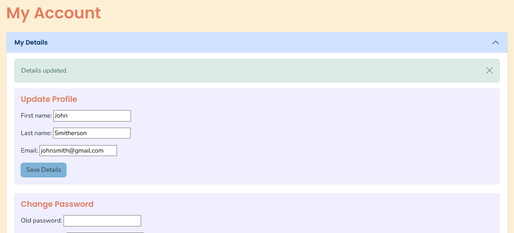

    </details>

11. As a user, I want friendly 404 and error pages that help me return to the main site.

- The site features a custom 404 page with helpful call-to-action buttons to ensure that users can be easily redirected to an existing page.

    <details><summary>Custom 404</summary>

    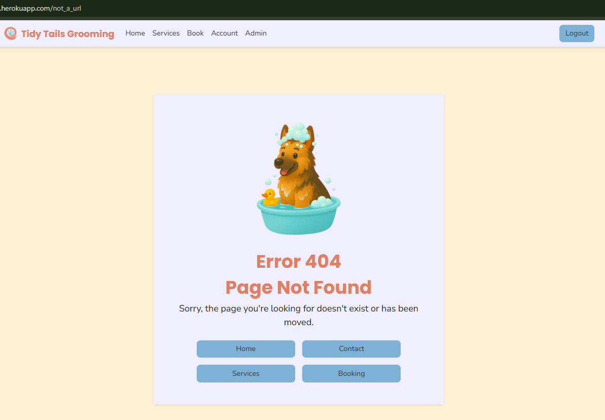

    </details>

## Design

### Colour Palette

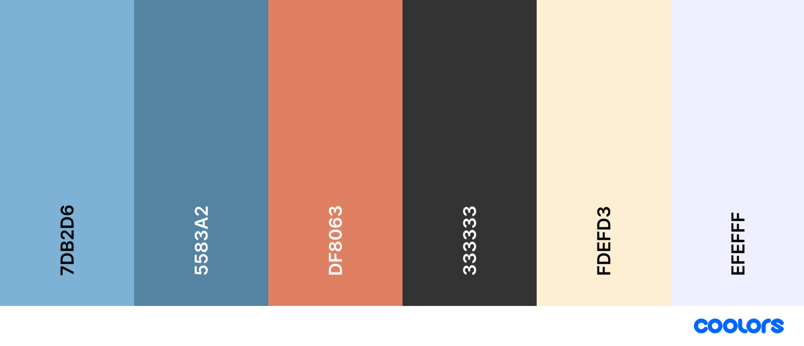

| Hex | Use | Purpose |
|-----|-----|---------|
| `#7DB2D6` | Interactions | Clearly distinguishable as an interactive element |
| `#5583A2` | Hover states | Provides visual feedback without distracting from the interaction |
| `#DF8063` | Headings | A warm colour that separates the headings from other page elements without being an eyesore |
| `#333333` | Text | High contrast to the background colours to make text easily readable |
| `#FAFAF8` | Background | Creates a clean, open feel to the page |
| `#EFEFFF` | Secondary BG | Slight offset against the primary background colour |

### Typography
Imported from **Google Fonts**:
- **Poppins (600–700)** — headings
- **Nunito Sans (400)** — body text

Both fonts provide clarity and warmth suitable for a customer-facing small business.

<details><summary>Typography - Poppins</summary>


</details>

<details><summary>Typography - Nunito Sans</summary>

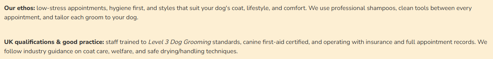

</details>

### Database Schema

<details><summary>Entity Relationship Diagram</summary>

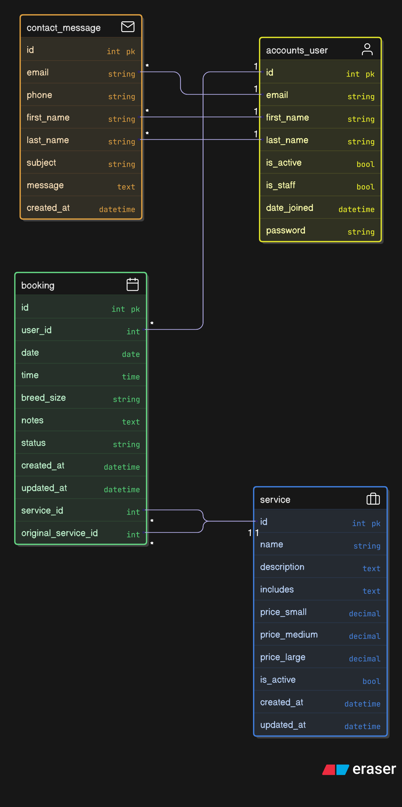

</details>

## Testing

### Compatibility and Responsiveness
Tested on Chrome, Edge, Firefox, and Safari using Chrome DevTools across:
- 1920 × 1080 desktop
- iPad Air
- Samsung Galaxy S20
- iPhone 15

**Result:**  
All layouts adjusted correctly with no horizontal scroll or broken components. The navbar, cards, modals, and accordions functioned across all breakpoints.

### Functional Testing

Manual testing was performed across all interactive and dynamic elements.

#### 1. User Registration

**Process:**  
Fill all required fields and click "Create Account".

**Expected:**  
Account created successfully, automatically logged in, redirected to homepage.

**Result:**  
Works as expected.

#### 2. Login and Logout

**Process:**  
Log in using credentials, then use the "Logout" button in the navbar.

**Expected:**  
Login updates header links, allows access to bookings and account; logout redirects to the homepage.

**Result:**  
Works as expected.

#### 3. Account Management

**Process:**  
From the Account page, update name and password.

**Expected:**  
Updates reflected immediately; delete opens modal confirmation before submission.  

**Actual:**  
Works as expected.

#### 4. Delete Account Confirmation

**Process:**  
From the Account page, select "Delete Account", don’t tick the checkbox, select "Yes, delete my account".

**Expected:**  
Opens delete account modal, requests checkbox be ticked, doesn’t delete account.

**Actual:**  
Works as expected.

#### 5. Delete Account

**Process:**  
From the delete account modal, tick the checkbox, select "Yes, delete my account".

**Expected:**  
Deletes account and associated data; redirects to homepage.

**Actual:**  
Works as expected.

#### 6. Booking Form Submission

**Process:**  
Fill all required fields and click "Create Booking".

**Expected:**  
Booking is saved and visible in "My Bookings"; booked time slot is no longer visible for new bookings.

**Result:**  
Works as expected.

#### 7. Edit Booking

**Process:**  
From "My Account > My Bookings", click "Edit".

**Expected:**  
Edit opens modal to adjust service/breed size/notes; saving the form amends any changed booking details.

**Result:**  
Works as expected.

#### 8. Cancel Booking

**Process:**  
From "My Account > My Bookings", click "Cancel", then click "Yes, cancel it".

**Expected:**  
Opens cancel booking modal for confirmation; cancels booking.

**Result:**  
Works as expected.

#### 9. Contact Form (Logged-In)

**Process:**  
Select the "Contact" link in the footer while logged in; verify auto-filled email/first name/last name; submit message.

**Expected:**  
Form fields pre-populated; submission success alert displayed.

**Result:**  
Works as expected.

#### 10. Contact Form (Guest)

**Process:**  
Select the "Contact" link in the footer without being logged in; fill in required fields; submit message.

**Expected:**  
No form fields pre-populated; submission success alert displayed.

**Result:**  
Works as expected.  

#### 11. Service Modals

**Process:**  
On the Services page, click "View Full Details" on a card.

**Expected:**  
Modal opens with full service info and pricing list.

**Result:**  
Works as expected.

#### 12. Admin Dashboard Controls

**Process:**  
Log in as superuser; open accordions for Services, Bookings, and Messages; test various admin controls.

**Expected:**  
Each section loads independently; admin actions work as labelled.

**Result:**  
Works as expected.

#### 13. Form Error Handling

**Process:**  
For all forms on site, leave required fields empty or enter invalid data; submit form.

**Expected:**  
Validation errors appear beneath inputs.

**Result:**  
Works as expected.

#### 14. 404 Page

**Process:**  
Enter an invalid URL.

**Expected:**  
Custom 404 page appears with buttons linking to Home, Contact, Services, and Booking.

**Result:**  
Works as expected.

#### 15. Mobile Navigation

**Process:**  
Resize window to below 576px and open the navbar toggle.

**Expected:**  
Menu collapses into a hamburger icon; expands on tap.

**Result:**  
Works as expected.

### Validation

#### HTML
Site validated with [W3C Markup Validator](https://validator.w3.org/) – no errors.  
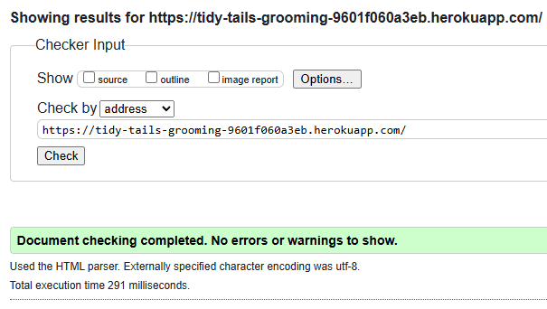

#### CSS
Site validated with [W3C CSS Validator](https://jigsaw.w3.org/css-validator/) – no errors.  
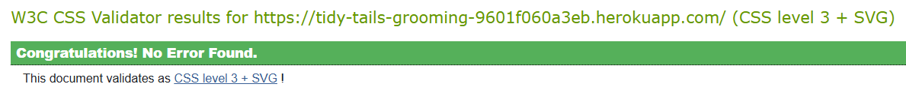

#### JavaScript
All `.js` files validated with [JSHint](https://jshint.com/) – no errors.

#### Python
All `.py` files passed `flake8` linting with no critical issues.

### Lighthouse
Each page achieved strong scores when run through Lighthouse.

### Bugs
| Issue | Cause | Resolution |
|-------|-------|------------|
| Navbar wrapping below 320 px | Bootstrap flex limits | Added responsive classes to adjust layout |
| Hero image zoom | `background-size: cover` cropping | Adjusted to `center top` and resized image |
| Textarea overflow on mobile | Browser default width | Applied `max-width: 100%` in CSS |
| Booking field alignment | Unstyled widgets | Added uniform input styling via CSS |

### Unfixed Bugs
- "View" and "Delete" buttons can overflow the accordion container on smaller mobile sizes. Buttons are still usable but it is not optimal UX.

All other known bugs were resolved before the final commit.

## Technologies

- [Python](https://docs.python.org/)
- [Django 5](https://www.djangoproject.com/)
- [HTML5](https://developer.mozilla.org/en-US/docs/Web/HTML)
- [CSS3](https://developer.mozilla.org/en-US/docs/Web/CSS)
- [JavaScript](https://developer.mozilla.org/en-US/docs/Web/JavaScript)
- [Bootstrap 5](https://getbootstrap.com/)
- [PostgreSQL](https://www.postgresql.org/)
- [Visual Studio Code](https://code.visualstudio.com/)
- [GitHub](https://github.com/)
- [Git](https://git-scm.com/docs)
- [Heroku](https://www.heroku.com/)
- [Google Fonts](https://fonts.google.com/)
- [Favicon.io](https://favicon.io/)
- [Font Awesome](https://fontawesome.com/)

## Deployment

### Version Control

Git used via VS Code:
```bash
git add .
git commit -m "Message"
git push
```

Repository: [tidy-tails-grooming](https://github.com/JackLamb99/tidy-tails-grooming)

### Deployment to Heroku

1. From the Heroku dashboard click "New".  
2. Choose "Create new app".  
3. Give the app a name.  
4. Choose a "Common Runtime" location (e.g. Europe).  
5. Select "Create app".  
6. Navigate to the "Deploy" tab.  
7. In "Deployment method", select "GitHub".  
8. Link your GitHub account if not already done.  
9. In the search box, type your repository name and click "Search".  
10. Once it appears, select "Connect" and wait for it to connect successfully.  
11. In "Automatic deploys", choose your main (or master) branch under "Choose a branch to deploy".  
12. Select "Enable Automatic Deploys".  
13. Navigate to the "Settings" tab.  
14. Under "Config Vars", select "Reveal Config Vars".  
15. Click “Add” for each pair:

| Key | Value |
|-----|-------|
| DJANGO_SETTINGS_MODULE | (route to your settings file) |
| SECRET_KEY | `paste your secret key` |
| ALLOWED_HOSTS | `<your-app-name>.herokuapp.com` |
| CSRF_TRUSTED_ORIGINS | `https://<your-app-name>.herokuapp.com` |
| DATABASE_URL | (paste your database URL) |

*(Update with actual hosting service once deployed.)*

16. In "Buildpacks", add the required buildpacks (Python for this project).  
17. Return to the "Deploy" tab and click "Deploy Branch".  
18. Once Heroku has built the app, click "View" to open it in a new tab.

### Cloning Repository
```bash
git clone https://github.com/JackLamb99/tidy-tails-grooming.git
```
Then install requirements:
```bash
pip install -r requirements.txt
python manage.py runserver
```

## Potential Future Developments

- **Email Notifications:** Automatic confirmations for bookings.  
- **Service Images:** Add photo uploads per service.  
- **Customer Reviews:** Authenticated review submissions.  

## Credits

### Media

The homepage hero image and carousel images were sourced free from [Pexels](https://www.pexels.com/).

[Back to top](#tidy-tails-grooming)
